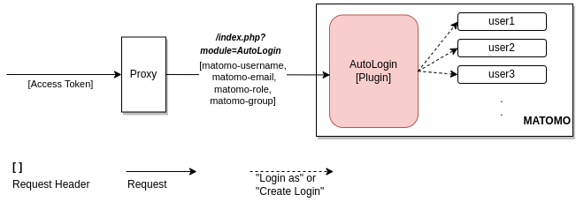
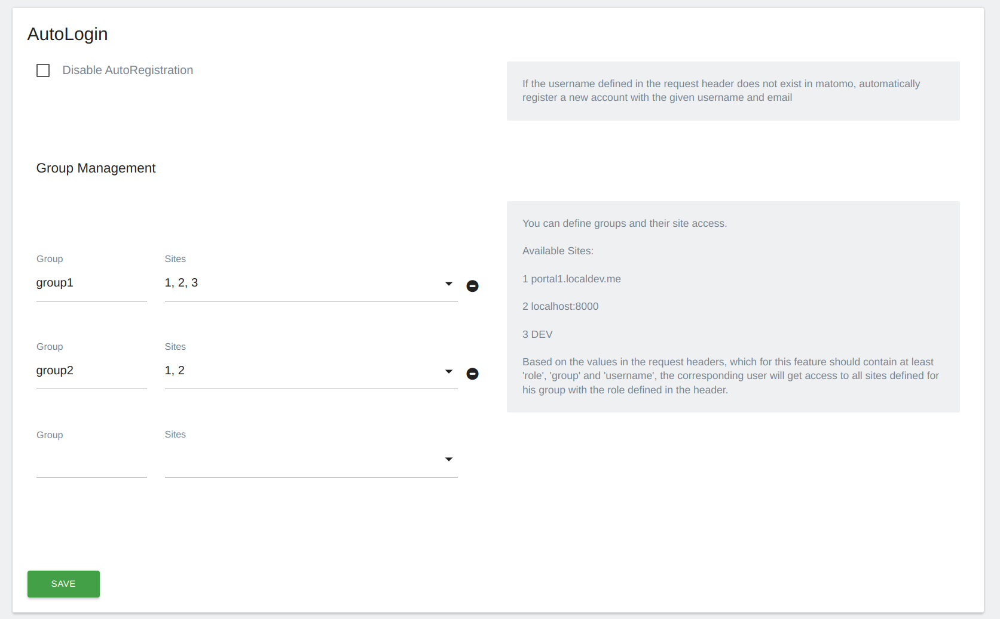

# Matomo AutoLogin Plugin

## Description

The Matomo AutoLogin Plugin adds new authentication and registration options by using incoming HTTP headers. It offers the following features:

1. **Login**: Matomo will automatically sign in users by extracting their username and role information from the incoming HTTP header. If a user with that username already exists in Matomo, they will be logged in with the specified role (View, Write, Admin, or Super User).
2. **Registration**: If the username provided in the HTTP header does not exist in Matomo, this plugin will register a new user with that username.
3. **Groups**: This plugin also allows users to be assigned to specific groups based on the group information provided in the HTTP header. Users gain access to all sites available to their assigned group. Groups can only be created by Superusers in the system settings.

Please note that this plugin comes with important security considerations, and should only be used with proper access control mechanism. Without these security measures, the plugin poses security risks.

Possible setup:

In this setup, all traffic towards Matomo goes through a proxy. The proxy validates an incoming access token from the user. The proxy then extracts relevant information from the access token to set their username, role etc. in matomo. 

## Configuration

Only Superuser can configure the AutoLogin plugin.

## Installation
There are two options for installing the AutoLogin plugin:
* Install it via the Matomo Marketplace.
* Put the php files and the plugin.json file in /plugins/AutoLogin and activate it in the Matomo's system settings.

## License
MIT 

